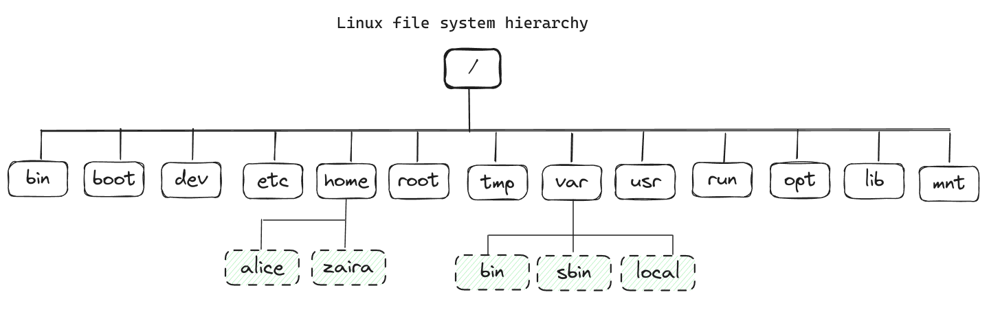

# Linux Notes

- [The Linux File-system Hierarchy](#the-linux-file-system-hierarchy)
- [Navigating the Linux File-system](#navigating-the-linux-file-system)
- [Managing Files and Directories](#managing-files-and-directories)
  - [Creating new directories using the mkdir command](#creating-new-directories-using-the-mkdir-command)
  - [Creating new files using the touch command](#creating-new-files-using-the-touch-command)
  - [Removing files and directories using the rm and rmdir command](#removing-files-and-directories-using-the-rm-and-rmdir-command)
  - [Copying files using the cp command](#copying-files-using-the-cp-command)
  - [Moving and renaming files and folders using the mv command](#moving-and-renaming-files-and-folders-using-the-mv-command)
- [Basic Commands for Viewing Files](#basic-commands-for-viewing-files)
- [Mastering Nano](#mastering-nano)
  - [Summary of keybindings in Nano](#summary-of-keybindings-in-nano)

---

## The Linux File-system Hierarchy

The ``/`` is the root directory and the starting point of the file system. The root directory contains all other directories and files on the system. The ``/`` character also serves as a directory separator between path names. For example, ``/home/alice`` forms a complete path.

The image below shows the complete file system hierarchy. Each directory servers a specific purpose.

Note that this is not an exhaustive list and different distributions may have different configurations.



Here is a table that shows the purpose of each directory:

|Location|Purpose|
|:-------|:------|
|/bin	 |Essential command binaries
|/boot	 |Static files of the boot loader, needed in order to start the boot process.
|/etc	 |Host-specific system configuration
|/home	 |User home directories
|/root	 |Home directory for the administrative root user
|/lib	 |Essential shared libraries and kernel modules
|/mnt	 |Mount point for mounting a filesystem temporarily
|/opt	 |Add-on application software packages
|/usr	 |Installed software and shared libraries
|/var	 |Variable data that is also persistent between boots
|/tmp	 |Temporary files that are accessible to all users


## Navigating the Linux File-system

Locating your current directory using the ``pwd`` command

It is easy to lose your way in the Linux file system, especially if you are new to the command line. You can locate your current directory using the pwd command.

Here is an example:

```sh
pwd
```

### Changing directories using the cd command

The command to change directories is ``cd`` and it stands for "change directory". You can use the ``cd`` command to navigate to a different directory.

Some other commonly used cd shortcuts are:

|Command            |Description|
|:------------------|:----------|
|``cd ..``	        |Go back one directory
|``cd ../..``	    |Go back two directories
|``cd`` or ``cd ~``	|Go to the home directory
|``cd -``	        |Go to the previous path

## Managing Files and Directories

When working with files and directories, you might want to copy, move, remove, and create new files and directories. Here are some commands that can help you with that.

### Creating new directories using the ``mkdir`` command

```sh
# creates an empty directory named "foo" in the current folder
mkdir foo
```

You can also create directories recursively using the ``-p`` option.

```sh
mkdir -p tools/index/helper-scripts
# output of tree
.
└── tools
    └── index
        └── helper-scripts

3 directories, 0 files
```

### Creating new files using the ``touch`` command

```sh
# creates empty file "file.txt" in the current folder
touch file.txt
```

### Removing files and directories using the ``rm`` and ``rmdir`` command

You can use the ``rm`` command to remove both files and non-empty directories.

|Command                |Description|
|:----------------------|:----------|
|``rm file.txt``        |Removes the file file.txt
|``rm -r directory``    |Removes the directory directory and its contents
|``rm -f file.txt``     |Removes the file file.txt without prompting for confirmation
|``rmdir``              |Removes an empty directory

### Copying files using the ``cp`` command

Syntax to copy files: ``cp source_file destination_of_file``

```sh
cp file1.txt /home/adam/logs
```

### Moving and renaming files and folders using the ``mv`` command

Syntax to move files: ``mv source_file destination_directory``

Move a file named ``file1.txt`` to a directory named ``backup``:

```sh
mv file1.txt backup/
```

To move a directory and its contents:

```sh
mv dir1/ backup/
```

Example: Rename a file from ``file1.txt`` to ``file2.txt``:

```sh
mv file1.txt file2.txt
```

Rename a directory from ``dir1`` to ``dir2``:

```sh
mv dir1 dir2
```

## Basic Commands for Viewing Files

Concatenate and display files using the ``cat`` command

The ``cat`` command in Linux is used to display the contents of a file. It can also be used to concatenate files and create new files.

```sh
cat [options] [file]
```

## Mastering Nano

Getting started with Nano: The user-friendly text editor

Nano is a user-friendly text editor that is easy to use and is perfect for beginners. It is pre-installed on most Linux distributions.

To create a new file using Nano, use the following command:

```sh
nano
```

To start editing an existing file with Nano, use the following command:

```sh
nano filename
```

### Summary of keybindings in Nano
- **General**
    - ``Ctrl+X``: Exit Nano (prompting to save if changes are made)
    - ``Ctrl+O``: Save the file
    - ``Ctrl+R``: Read a file into the current file
    - ``Ctrl+G``: Display the help text
- **Editing**
    - ``Ctrl+K``: Cut the current line and store it in the cutbuffer
    - ``Ctrl+U``: Paste the contents of the cutbuffer into the current line
    - ``Alt+6``: Copy the current line and store it in the cutbuffer
    - ``Ctrl+J``: Justify the current paragraph
- **Navigation**
    - ``Ctrl+A``: Move to the beginning of the line
    - ``Ctrl+E``: Move to the end of the line
    - ``Ctrl+C``: Display the current line number and file information
    - ``Ctrl+_`` (Ctrl+Shift+-): Go to a specific line (and optionally, column) number
    - ``Ctrl+Y``: Scroll up one page
    - ``Ctrl+V``: Scroll down one page
- **Search and Replace**
    - ``Ctrl+W``: Search for a string (then Enter to search again)
    - ``Alt+W``: Repeat the last search but in the opposite direction
    - ``Ctrl+\``: Search and replace
- **Miscellaneous**
    - ``Ctrl+T``: Invoke the spell checker, if available
    - ``Ctrl+D``: Delete the character under the cursor (does not cut it)
    - ``Ctrl+L``: Refresh (redraw) the current screen
    - ``Alt+U``: Undo the last operation
    - ``Alt+E``: Redo the last undone operation